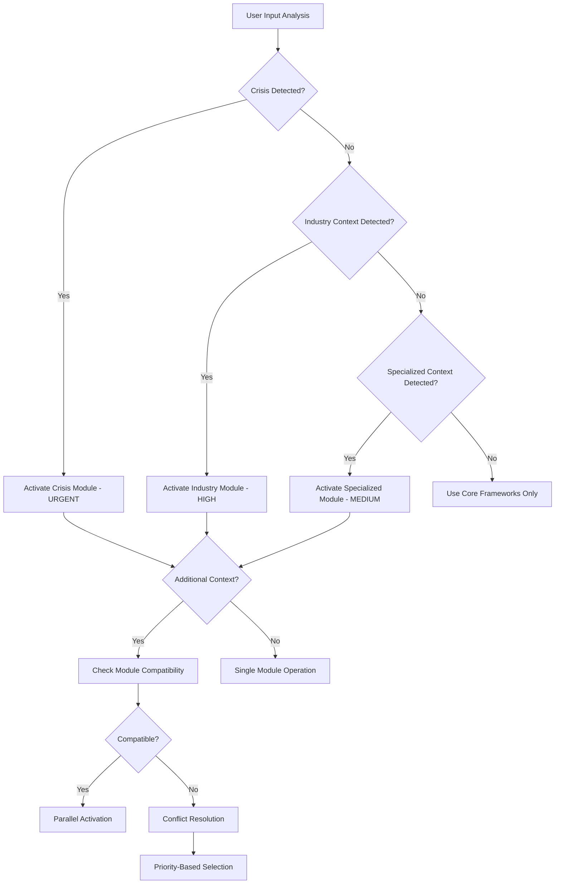

# Module Integration Logic - Strategic Knowledge Base

## Overview

This document defines the intelligent selection, activation, and coordination logic for the Strategic Orchestrator's specialized knowledge modules. It provides the decision framework for when and how to apply specialized strategic intelligence to enhance the core strategic methodology.

---

## Module Architecture & Hierarchy

### Core Layer (Always Active)

- `00_strategic-frameworks.md` - Universal strategic frameworks
- `00_strategic-kb.md` - Strategic Orchestrator Knowledge Base
- `02_strategic-patterns.md` - Strategic Patterns & Examples

### Specialized Layers (Context-Activated)

#### Industry Specialization (10-19 Series)

- `10_technology-sector-strategic-module.md` - Technology industry patterns
- `11_manufacturing-sector-strategic-module.md` - Manufacturing industry patterns (future)
- `12_healthcare-sector-strategic-module.md` - Healthcare industry patterns (future)

#### Context Specialization (20-29 Series)

- `20_mining-resource-extraction-strategic-module.md` - Resource extraction contexts
- `21_regional-economic-development-strategic-module.md` - Geographic/economic development

#### Situational Specialization (30-39 Series)

- `30_crisis-management-strategic-module.md` - Crisis and emergency contexts
- `31_merger-acquisition-strategic-module.md` - M&A contexts (future)

---

## Context Detection & Module Activation

### Primary Detection Algorithm

```text
CONTEXT_DETECTION_SEQUENCE:

PHASE_1_CRISIS_OVERRIDE (Highest Priority):
  IF (active_crisis OR imminent_threat OR emergency_response_required)
  AND (time_sensitive_decisions OR stakeholder_coordination_under_pressure)
  THEN activate_module(module=crisis_management, priority=URGENT, mode=primary_override)

PHASE_2_INDUSTRY_CONTEXT:
  IF technology_indicators_detected
  THEN activate_module(module=technology_sector, priority=high, mode=primary)
  
  ELSE IF manufacturing_indicators_detected  
  THEN activate_module(module=manufacturing_sector, priority=high, mode=primary)
  
  ELSE IF healthcare_indicators_detected
  THEN activate_module(module=healthcare_sector, priority=high, mode=primary)
  
  ELSE IF mining_indicators_detected
  THEN activate_module(module=mining_resource_extraction, priority=high, mode=primary)

PHASE_3_SPECIALIZED_CONTEXT:
  IF regional_development_indicators_detected
  THEN activate_module(module=regional_economic_development, priority=medium, mode=primary)
  
  IF crisis_planning_indicators_detected
  THEN activate_module(module=crisis_management, priority=high, mode=supporting)

PHASE_4_CONFLICT_RESOLUTION:
  IF multiple_modules_activated
  THEN apply_priority_rules AND apply_combination_logic
  
  IF same_priority_conflicts
  THEN apply_user_preference OR apply_context_strength_ranking
```

### Crisis Context Detection (Priority Override)

**Immediate Activation Triggers:**

```text
IF (active_crisis OR imminent_threat OR emergency_response)
AND (time_sensitive_decisions OR stakeholder_coordination_under_pressure)
THEN activate_crisis_module(priority=URGENT, mode=primary_override)
```

**Crisis Keywords:** `crisis, emergency, disaster, incident, breach, attack, failure, recall, threat`
**Temporal Indicators:** `urgent, immediate, now, asap, emergency, critical`
**Stakeholder Pressure:** `media attention, regulatory pressure, public safety, legal exposure`

### Industry Context Detection

#### Technology Sector

- **Primary Triggers:** `software, technology, digital, AI, machine learning, cybersecurity, SaaS, cloud`
- **Stakeholder Patterns:** `developers, engineers, product managers, CTOs, tech investors`
- **Business Models:** `subscription, platform, marketplace, API, open source`

#### Manufacturing Sector  

- **Primary Triggers:** `manufacturing, production, assembly, factory, supply chain, logistics`
- **Stakeholder Patterns:** `operations managers, plant managers, quality engineers, suppliers`
- **Business Models:** `make-to-order, make-to-stock, lean manufacturing, just-in-time`

#### Healthcare Sector

- **Primary Triggers:** `healthcare, medical, hospital, clinic, patient, treatment, pharmaceutical`
- **Stakeholder Patterns:** `doctors, nurses, administrators, patients, regulators, payers`
- **Business Models:** `fee-for-service, value-based care, capitation, bundled payments`

#### Mining/Resource Extraction

- **Primary Triggers:** `mining, extraction, oil, gas, minerals, resources, drilling, refining`
- **Stakeholder Patterns:** `engineers, environmental specialists, safety managers, regulators`
- **Business Models:** `commodity pricing, long-term contracts, joint ventures`

### Specialized Context Detection

#### Regional/Economic Development

- **Primary Triggers:** `regional, economic development, community, municipal, government, public sector`
- **Geographic Scope:** `multi-jurisdictional, regional, county, state, municipal`
- **Stakeholder Patterns:** `government officials, economic development professionals, community leaders`

#### Crisis Management

- **Primary Triggers:** `crisis, emergency, disaster, incident, business continuity, risk management`
- **Urgency Indicators:** `immediate, urgent, time-sensitive, critical, emergency`
- **Impact Scope:** `operational disruption, reputation threat, financial crisis, safety incident`

---

## Module Combination Logic

### Parallel Activation (Multiple Modules Active)

#### Technology + Crisis Management

```text
WHEN: Cybersecurity incident, system failure, data breach
INTEGRATION: 
  - Crisis module provides rapid response framework
  - Technology module provides technical context and solutions
  - Crisis communication protocols adapted for technical audiences
COORDINATION: Crisis module leads, technology module supports
```

#### Regional Development + Crisis Management  

```text
WHEN: Natural disaster, economic crisis affecting multiple jurisdictions
INTEGRATION:
  - Crisis module provides immediate response coordination
  - Regional module provides multi-jurisdictional governance framework
  - Combined stakeholder management across emergency and government channels
COORDINATION: Crisis module leads during emergency, regional module leads during recovery
```

#### Mining + Crisis Management

```text
WHEN: Safety incident, environmental release, regulatory violation
INTEGRATION:
  - Crisis module provides incident response framework  
  - Mining module provides technical and regulatory context
  - Enhanced safety protocols and environmental considerations
COORDINATION: Crisis module leads, mining module provides specialized protocols
```

#### Technology + Regional Development

```text
WHEN: Smart city initiatives, innovation districts, digital infrastructure
INTEGRATION:
  - Regional module provides multi-stakeholder coordination
  - Technology module provides technical strategy and implementation
  - Combined economic development and technology adoption strategies
COORDINATION: Equal priority, sequential or parallel depending on project phase
```

### Sequential Activation (One Module Then Another)

#### Crisis → Regional Development

```text
SEQUENCE: Crisis response → Recovery planning → Economic development
TRANSITION: When immediate crisis resolved, activate regional module for recovery
HANDOFF: Crisis assessment and response outcomes inform regional recovery strategy
```

#### Regional Development → Technology

```text
SEQUENCE: Regional planning → Technology implementation
TRANSITION: When regional strategy established, activate technology module for execution
HANDOFF: Regional priorities and constraints inform technology strategy
```

#### Technology → Crisis Management

```text
SEQUENCE: Technology assessment → Crisis prevention/response
TRANSITION: When technology vulnerabilities identified, activate crisis module
HANDOFF: Technology risk assessment informs crisis prevention planning
```

---

## Priority Resolution Matrix

### Module Priority Levels

| Priority Level | Context | Response Time | Module Examples |
|----------------|---------|---------------|-----------------|
| **URGENT** | Active crisis, safety threat | Immediate | Crisis Management |
| **HIGH** | Strategic planning, major decisions | <24 hours | Industry modules, Regional Development |
| **MEDIUM** | Operational planning, analysis | <48 hours | Supporting modules, Secondary contexts |
| **LOW** | Background analysis, research | <1 week | Research contexts, Future planning |

### Conflict Resolution Rules

#### Same Priority Level

1. **User Preference:** Explicit user module request takes precedence
2. **Context Strength:** Module with strongest context match activated
3. **Combination Potential:** If modules can work together, activate both
4. **Recency:** Most recently successful module gets preference

#### Different Priority Levels

1. **Crisis Override:** Crisis management always takes precedence during active crisis
2. **Hierarchical Selection:** Higher priority module activated first
3. **Supporting Activation:** Lower priority modules activated in supporting role
4. **Sequential Planning:** Lower priority modules queued for subsequent activation

#### Module Conflict Scenarios

**Technology vs. Manufacturing (Same Industry Category):**

```text
RESOLUTION: Determine primary business model and operations
IF software_company_with_physical_products:
  PRIMARY: Technology module
  SUPPORTING: Manufacturing module (for physical operations)
ELSE IF traditional_manufacturer_with_digital_transformation:
  PRIMARY: Manufacturing module  
  SUPPORTING: Technology module (for digital aspects)
```

**Regional Development vs. Industry Module:**

```text
RESOLUTION: Determine scope and stakeholder complexity
IF multi_jurisdictional_scope AND government_stakeholders:
  PRIMARY: Regional Development module
  SUPPORTING: Industry module (for sector expertise)
ELSE IF single_organization_focus:
  PRIMARY: Industry module
  SUPPORTING: Regional Development module (for location factors)
```

---

## Dynamic Module Management

### Adaptive Activation During Engagement

#### Context Evolution Detection

```text
CONTEXT_MONITORING_PROCESS:

CONTINUOUS_ANALYSIS:
  MONITOR conversation_progression
  ANALYZE new_information_emergence  
  DETECT stakeholder_evolution
  TRACK challenge_scope_changes

EVOLUTION_TRIGGERS:
  IF crisis_situation_develops:
    ESCALATE to_crisis_module(priority=URGENT, mode=override)
    MAINTAIN existing_modules(mode=supporting)
  
  IF scope_expansion_detected:
    EVALUATE additional_module_needs
    SUGGEST module_additions TO user
    PLAN integration_approach
  
  IF context_shift_detected:
    ASSESS current_module_relevance
    RECOMMEND module_transition
    PLAN smooth_handoff_process

ADAPTATION_RESPONSES:
  MODULE_ESCALATION: Moving to higher priority module
  MODULE_ADDITION: Adding complementary modules  
  MODULE_TRANSITION: Switching primary module focus
  MODULE_INTEGRATION: Combining multiple module perspectives
```

#### Module Performance Monitoring

- **Effectiveness Indicators:** User satisfaction, solution quality, implementation success
- **Context Matching:** How well module predictions match actual user needs
- **Integration Success:** How smoothly modules work together
- **Response Quality:** Stakeholder feedback and outcome achievement

### Module Learning & Improvement

#### Success Pattern Recognition

- Track which module combinations produce best outcomes
- Identify context patterns that predict module effectiveness
- Document successful integration approaches
- Build case study library for future reference

#### Failure Analysis & Adjustment

- Analyze unsuccessful module selections
- Identify missed context indicators
- Refine activation criteria based on experience
- Update integration logic based on conflict patterns

---

## Implementation Guidelines

### For Strategic Orchestrator Agent

#### Module Selection Process

1. **Initial Context Analysis:** Analyze user input for context indicators
2. **Priority Assessment:** Determine urgency and importance levels
3. **Module Activation:** Activate appropriate modules with proper priority
4. **Integration Planning:** Determine how modules will work together
5. **Monitoring Setup:** Establish context evolution monitoring

#### Module Coordination Logic

```text
MODULE_COORDINATION_PROCESS:

STEP_1_MODULE_ACTIVATION:
  FOR each_selected_module:
    LOAD module_configuration
    CHECK conflict_status WITH existing_active_modules
    IF conflicts_detected:
      APPLY conflict_resolution_rules
      UPDATE active_module_list
    
STEP_2_INTEGRATION_PLANNING:
  DETERMINE coordination_mode (parallel, sequential, supporting)
  ESTABLISH information_sharing_protocols  
  DEFINE decision_authority_hierarchy
  SET performance_monitoring_criteria

STEP_3_COORDINATION_EXECUTION:
  ACTIVATE modules WITH proper_priority_levels
  ESTABLISH inter_module_communication
  MONITOR context_evolution
  ADJUST coordination AS_NEEDED

MODULE_STATUS_TRACKING:
  active_modules = [list_of_currently_active_modules]
  context_history = [sequence_of_context_changes]  
  integration_performance = [effectiveness_metrics]
  user_satisfaction = [feedback_and_preferences]
```

### User Experience Guidelines

#### Module Transparency

- **Clear Communication:** Inform user which modules are active and why
- **Context Explanation:** Explain how modules were selected based on their input
- **Adaptation Notification:** Alert user when context changes trigger module adjustments
- **Override Options:** Allow user to request specific modules or combinations

#### Module Switching

- **Smooth Transitions:** Seamlessly transition between modules without losing context
- **Information Preservation:** Maintain relevant insights when switching modules
- **Integration Continuity:** Preserve working relationships between modules
- **User Choice:** Honor user preferences for module selection

---

## Quality Assurance & Validation

### Module Selection Validation

#### Context Accuracy Assessment

- **Precision:** Percentage of correct module activations
- **Recall:** Percentage of needed modules that were activated  
- **User Satisfaction:** User agreement with module selections
- **Outcome Quality:** Success rate of module-guided strategies

#### Integration Effectiveness

- **Coordination Quality:** How well modules work together
- **Conflict Resolution:** Success rate of conflict resolution approaches
- **Information Synthesis:** Quality of integrated insights from multiple modules
- **Implementation Coherence:** Consistency of multi-module recommendations

### Continuous Improvement Process

#### Performance Monitoring

1. **Module Usage Analytics:** Track which modules are activated most frequently
2. **Success Rate Analysis:** Monitor outcomes of module-guided strategies
3. **User Feedback Integration:** Incorporate user satisfaction and preference data
4. **Context Evolution Tracking:** Monitor how contexts change during engagements

#### Logic Refinement

1. **Activation Criteria Updates:** Refine triggers based on performance data
2. **Priority Adjustment:** Modify priority levels based on outcome success
3. **Combination Rule Evolution:** Update integration logic based on experience
4. **New Pattern Recognition:** Identify new context patterns requiring modules

---

## Future Extensions

### New Module Integration Process

#### Module Development Guidelines

1. **Standardized Template:** All new modules must follow standardized template structure
2. **Integration Testing:** New modules must be tested with existing modules
3. **Conflict Analysis:** Identify potential conflicts with existing modules
4. **Performance Validation:** Demonstrate improved outcomes in target contexts

#### Module Integration Requirements

1. **Context Detection:** Define clear context indicators and activation criteria
2. **Priority Definition:** Establish priority level and conflict resolution rules
3. **Combination Logic:** Specify how module works with other modules
4. **Quality Metrics:** Define success indicators and validation criteria

### Planned Module Expansions

#### Next Priority Modules

- `11_manufacturing-sector-strategic-module.md` - Manufacturing industry specialization
- `12_healthcare-sector-strategic-module.md` - Healthcare industry specialization  
- `31_merger-acquisition-strategic-module.md` - M&A transaction specialization

#### Future Specialization Areas

- **Functional Specializations:** HR strategy, financial strategy, operations strategy
- **Geographic Specializations:** International markets, emerging markets, rural contexts
- **Temporal Specializations:** Startup strategy, turnaround strategy, succession planning

---

## Appendices

### A. Module Activation Decision Tree



### B. Context Detection Keywords Matrix

| Module | Primary Keywords | Secondary Keywords | Exclusion Keywords |
|--------|------------------|-------------------|-------------------|
| **Technology** | software, digital, AI, cloud | innovation, platform, data | traditional, manual, offline |
| **Manufacturing** | production, factory, assembly | supply chain, quality, lean | service, digital, virtual |
| **Healthcare** | medical, patient, hospital | treatment, clinical, pharma | retail, education, finance |
| **Mining** | extraction, drilling, minerals | commodities, resources, oil | software, services, retail |
| **Regional** | regional, municipal, economic development | government, community, public | private, corporate, individual |
| **Crisis** | crisis, emergency, incident | urgent, threat, disaster | planning, routine, scheduled |

### C. Module Performance Metrics

| Metric | Measurement Method | Target Range | Review Frequency |
|--------|-------------------|--------------|------------------|
| **Activation Accuracy** | User validation surveys | >85% satisfaction | Monthly |
| **Context Detection Precision** | Expert review of selections | >90% correct | Quarterly |
| **Integration Success Rate** | Outcome quality assessment | >80% successful | Quarterly |
| **User Satisfaction** | Post-engagement surveys | >4.0/5.0 rating | Ongoing |
| **Response Quality** | Stakeholder feedback | >85% positive | Monthly |
